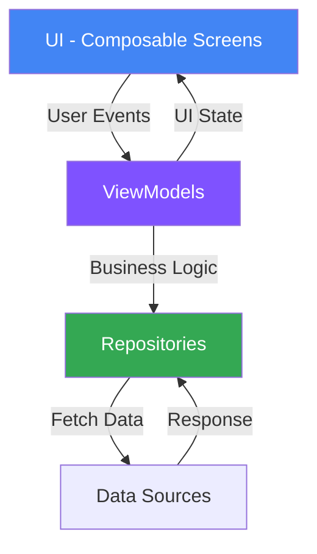

<div align="center">

# 🐝 Blr Hives

### *Bangalore's Hyperlocal Community Network*

[](https://github.com/yourusername/BlrHives)
[](https://kotlinlang.org/)
[](https://developer.android.com/jetpack/compose)

**A native Android social platform for discovering and creating niche, interest-based communities across Bangalore**

[Features](#-features) • [Tech Stack](#-tech-stack) • [Architecture](#-architecture) • [Getting Started](#-getting-started)

</div>

---

## 🎯 What Is Blr Hives?

**Blr Hives** connects Bangalore residents through hyperlocal communities—from coding meetups and foodie groups to trekking clubs and book discussions. Instead of scattered WhatsApp groups and Facebook communities, find all your local interests in one native Android app.

---

## ✨ Features

| Feature | Description |
|:---|:---|
| 🌐 **Community Discovery** | Explore curated "Hives" categorized by interests, trending activity, and location |
| 🎨 **Hive Creation** | Create and moderate your own community in seconds with intuitive tools |
| 💬 **Rich Interactions** | Dedicated feeds, direct messaging, and real-time engagement |
| 🔐 **Secure Auth** | User onboarding with authentication via dedicated `AuthScreen` |
| 🧭 **Smooth Navigation** | Bottom navigation bar with seamless screen transitions |

---

## 🛠 Tech Stack

<div align="center">

| Layer | Technology | Status |
|:---:|:---:|:---:|
| **Language** |  | ✅ Core |
| **UI** |  | ✅ Implemented |
| **Architecture** | MVVM Pattern | ✅ Implemented |
| **Navigation** | Jetpack Navigation | ✅ Implemented |
| **Async** | Coroutines + Flow | ✅ Implemented |
| **Networking** | Retrofit | 🔨 In Progress |
| **Local Storage** | Room / DataStore | 🚧 Not Started |
| **DI** | Hilt | 📋 Planned |

</div>

---

## 🏗 Architecture: MVVM Pattern

Following **Google's recommended architecture** for scalability and testability:



### Key Components

- **View (Composables)**: UI screens observing state from ViewModels
- **ViewModel**: Manages UI state and handles business logic
- **Repository**: Abstracts data sources (API + local storage)
- **Data Layer**: Remote APIs and local database (in progress)

### 📁 Project Structure

```
app/
├── ui/screens/          # Home, Explore, Chat, Profile screens
├── ui/components/       # Reusable composables
├── viewmodels/          # UI state management
├── data/repositories/   # Data layer (in progress)
└── navigation/          # NavHost setup
```

---

## 🗺️ Navigation Routes

| Route | Screen | Purpose |
|:---|:---|:---|
| `home` | HomeScreen | Personalized feed |
| `explore` | ExploreScreen | Discover new Hives |
| `chat` | ChatScreen | Message hub |
| `profile` | ProfileScreen | User settings |
| `create_hive` | CreateHiveScreen | Create community |
| `hive_detail/{id}` | HiveDetailScreen | Community details |
| `private_chat/{id}` | PrivateChatScreen | Direct messaging |

---

## 🚧 Development Status

> **Note**: This project is in **active development**. Core architecture is complete; backend integration and data persistence are ongoing.

### ✅ Completed

- [x] MVVM architecture foundation
- [x] All UI screens with Jetpack Compose
- [x] Navigation graph with bottom navigation
- [x] Material3 theming

### 🔨 In Progress

- [ ] Backend API integration (Retrofit)
- [ ] Real-time chat (WebSockets/Flow)
- [ ] Image loading (Coil)

### 🚧 Not Started

- [ ] Local data persistence (Room/DataStore)
- [ ] Dependency injection (Hilt)
- [ ] Push notifications (FCM)
- [ ] Content moderation tools
- [ ] Search & advanced filters
- [ ] Unit & UI tests

---

## 🚀 Getting Started

### Prerequisites

- Android Studio Hedgehog (2023.1.1+)
- JDK 17+
- Android SDK 34+

### Installation

```bash
# Clone the repository
git clone https://github.com/nayansm004/Blr-hives.git
cd Blr-hives

# Open in Android Studio and sync Gradle
# Run on emulator or device
```

---

## 👨‍💻 Author

**[Nayan S]**
- GitHub: [@nayansm004](https://github.com/nayansm004)
- LinkedIn: [Nayan S](https://linkedin.com/in/nayansm004)

---

<div align="center">

**Made with ❤️ and Kotlin in Bangalore** 🇮🇳

### ⭐ Star this repo if you find it interesting!

</div>
